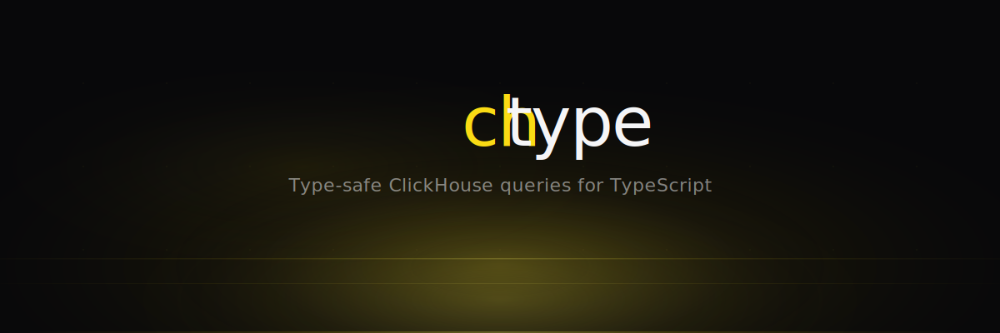

<p align="center">
  <a href="https://chtype.jantokic.com">
    
  </a>
</p>

<p align="center">
  <a href="https://www.npmjs.com/package/@jantokic/chtype"></a>
  <a href="https://www.npmjs.com/package/@jantokic/chtype"></a>
  <a href="https://github.com/jantokic/chtype/blob/main/LICENSE"></a>
  = 20" />
  = 5.0" />
  
</p>

<p align="center">
  <b>Type-safe ClickHouse toolkit for TypeScript.</b><br/>
  Schema codegen &middot; Query builder &middot; Full autocomplete &middot; Zero overhead
</p>

<p align="center">
  <a href="https://chtype.jantokic.com">Website</a> &middot;
  <a href="https://www.npmjs.com/package/@jantokic/chtype">npm</a> &middot;
  <a href="https://github.com/jantokic/chtype/issues">Issues</a>
</p>

---

## Install

```bash
npm install @jantokic/chtype
# or
bun add @jantokic/chtype
```

## Why chtype?

ClickHouse has no mature ORM for TypeScript. The official `@clickhouse/client` is excellent but gives you raw SQL strings — typos in column names only fail at runtime, result types are manually maintained, and schema drift silently breaks your code.

chtype fixes this with three subpath imports:

| Import | What it does |
|---|---|
| `chtype/codegen` | Introspects your ClickHouse DB and generates TypeScript interfaces |
| `chtype/query` | Type-safe query builder with ClickHouse-specific functions (argMax, FINAL, SETTINGS) |
| `chtype/client` | Thin wrapper over `@clickhouse/client` that connects query builder to execution |

## Quick Start

### 1. Generate types from your database

```bash
npx chtype generate \
  --host http://localhost:8123 \
  --database my_db \
  --output ./src/generated/schema.ts
```

This produces a file like:

```typescript
// @generated by chtype — do not edit manually

/**
 * Table: `users`
 * Engine: ReplacingMergeTree(updated_at)
 * ORDER BY: (user_id)
 */
export type UsersRow = {
  user_id: string;
  name: string;
  score: number | null;
  tags: string[];
  updated_at: string;
};

/** Insert type for `users` — DEFAULT columns are optional. */
export type UsersInsert = {
  user_id: string;
  name: string;
  score?: number | null;
  tags?: string[];
  updated_at?: string;
};

export type Database = {
  users: {
    row: UsersRow;
    insert: UsersInsert;
    engine: "ReplacingMergeTree";
    versionColumn: "updated_at";
  };
};
```

### 2. Query with full type safety

```typescript
import { createQueryBuilder } from 'chtype/query';
import { createClient } from 'chtype/client';
import type { Database } from './generated/schema';

const qb = createQueryBuilder<Database>();
const ch = createClient<Database>({
  url: 'http://localhost:8123',
  database: 'my_db',
});

// Column names autocomplete — typos caught at compile time
const query = qb
  .selectFrom('users')
  .select(['user_id', 'name', 'score'])
  .where('score', '>', qb.param('minScore', 'Float64'))
  .orderBy('score', 'DESC')
  .limit(20)
  .compile();

const users = await ch.execute(query);
```

### 3. ClickHouse-specific features

```typescript
// argMax — first-class citizen for ReplacingMergeTree tables
const latest = qb
  .selectFrom('users')
  .select([
    'user_id',
    qb.fn.argMax('name', 'updated_at').as('name'),
    qb.fn.argMax('score', 'updated_at').as('score'),
  ])
  .groupBy('user_id')
  .compile();

// FINAL modifier (for debug/audit only)
const withFinal = qb
  .selectFrom('users')
  .select(['user_id', 'name'])
  .final()
  .compile();

// SETTINGS clause
const withSettings = qb
  .selectFrom('users')
  .select(['user_id'])
  .settings({ max_execution_time: 30 })
  .compile();

// Type-safe inserts — MATERIALIZED columns excluded, DEFAULT columns optional
await ch.insert('users', [
  { user_id: '123', name: 'Alice' },
  { user_id: '456', name: 'Bob', score: 42 },
]);
```

### 4. All values are parameterized

The query builder **only** accepts `Param` or `Expression` values in WHERE clauses — raw strings are not allowed. This makes SQL injection impossible by design.

```typescript
// This is the only way to pass values — always safe
qb.selectFrom('users')
  .where('name', '=', qb.param('name', 'String'))

// Raw strings in WHERE are a type error — won't compile
```

## Config File

Instead of CLI flags, use a `chtype.config.ts` file:

```typescript
import { defineConfig } from 'chtype/codegen';

export default defineConfig({
  connection: {
    host: 'http://localhost:8123',
    database: 'my_db',
    username: 'default',
    password: process.env.CLICKHOUSE_PASSWORD,
  },
  output: './src/generated/schema.ts',
  bigints: true,  // set to true to map UInt64/Int64 to bigint instead of string
  include: ['users', 'events', 'market_*'],
  exclude: [],
});
```

Then run:

```bash
npx chtype generate --config chtype.config.ts
```

## How It Compares

| Feature | chtype | Raw @clickhouse/client | Kysely + CH dialect | hypequery |
|---|---|---|---|---|
| Column autocomplete | Yes | No | Yes (limited) | Yes |
| Schema drift detection | Yes (codegen) | No | No | Yes (codegen) |
| argMax / FINAL / SETTINGS | Yes | Manual SQL | No | No |
| Insert type validation | Yes (Row vs Insert) | No | No | No |
| Engine metadata in types | Yes | No | No | Partial |
| Zero runtime overhead | Yes | N/A | Yes | No (framework) |
| SQL injection prevention | By design | Manual | By design | By design |

## Requirements

- **Node.js** >= 20 (or Bun)
- **TypeScript** >= 5.0
- **ClickHouse** server (any recent version)

## License

MIT
